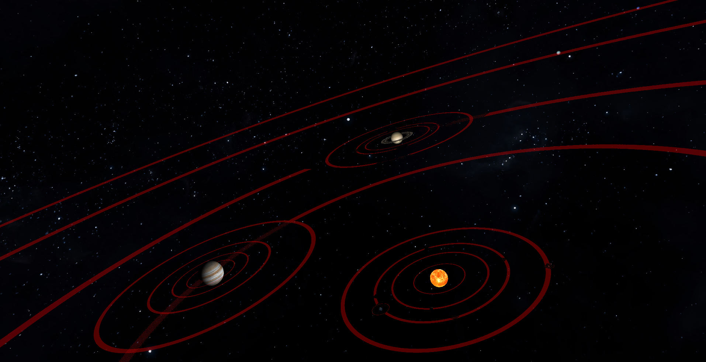

# CPE-471-Computer-Graphics-Final-Project
Final Graphics project for CPE 471, completed in Fall 2019.

## Solar System Simulation
By Justin Privitera
Contact at jprivite@calpoly.edu

### Overview
My goal for this project was to create a somewhat-realistic simulation of our solar system. The following is a list of implemented features:

* Sun
* All 8 Planets
* 10 Moons
* Accurate orbit distances and periods
* Accurate rotation periods
* Accurate object sizes
* Atmospheres for Earth and Venus
* Day/night cycle for Earth with linear interpolation between nighttime and daytime textures.
* An appropriate skybox
* Comets
* Asteroid Belt
* Orbit Visualization tool
* Additional Camera Controls
* Camera object tracking
* Time adjustment controls
* Real-time shadowing

Notes:
* This project was my first significant foray into computer graphics. As such, much of the code and logic is simplistic, however, the end result is something I'm still quite proud of.
* This project should run on windows and linux, and can be built using cmake. A run script is included.
* All sizes and distances are scaled down to make the project more visually appealing.
* The orbits and sizes of some moons had to be scaled up once everything else was scaled down so they would be visible.
* There are no axial tilts; otherwise, all planets and moons are accurately scaled, aside from those affected by the previous bullet point.
* For camera object tracking, I have selected 10 objects that I find the most interesting; these can be selected with the number keys. These are the objects each number maps to:
1. Venus
2. Earth
3. Mars
4. Jupiter
5. Saturn
6. Moon
7. Io
8. Ganymede
9. Titan
10. Comet

### Controls
Some of the controls have two functions. "l" and "p" toggle between the first and second. The controls use the first function by default.

* w = move forward/decrease radius
* a = move left/circle clockwise around object
* s = move backwards/increase radius
* d = move right/circle counter-clockwise around object
* spacebar = move up/circle up and over object
* left shift = move down/circle down and under object
* l = lock camera to an object. This will change the controls prior to this one to the 2nd option. Pressing the number keys will change which object the camera is linked to.
* p = unlock the camera from an object. This will change the controls prior to "l" back to their default state.
* q = look left
* e = look right
* r = look up
* f = look down
* t = rotate view clockwise
* g = rotate view counter-clockwise
* left control = reset orientation
* equal = increase camera movement speed
* minus = lower camera movement speed
* up = speed up time
* down = slow down time
* v = toggle orbit visualization
* number keys = object selection

### Screenshots

Jupiter and moons

The Planets

Mars and one of its moons, Phobos

Earth's Day/Night Cycle

Earth's Atmosphere

Venus's Atmosphere

Orbit Visualization Tool

The Asteroid Belt

The comet

Saturn leaving a shadow on its rings

The Moon leaving a real time shadow on Earth
